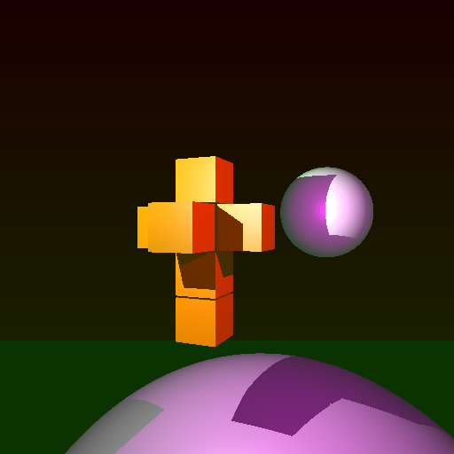

# CS488-raytracer
A basic ray tracer with Phong Illumination



---

## Build

```
$ cd CS488-raytracer
CS488-raytracer$ premake4 gmake
CS488-raytracer$ make
CS488-raytracer$ cd src
CS488-raytracer/src$ premake4 gmake
CS488-raytracer/src$ make
```

---

## Dependencies
* OpenGL 3.2+
* GLFW
    * http://www.glfw.org/
* Lua
    * http://www.lua.org/
* Premake4
    * https://github.com/premake/premake-4.x/wiki
    * http://premake.github.io/download.html
* GLM
    * http://glm.g-truc.net/0.9.7/index.html
* ImGui
    * https://github.com/ocornut/imgui

This build is only tested on Linux, but should theoretically also work for OSX.